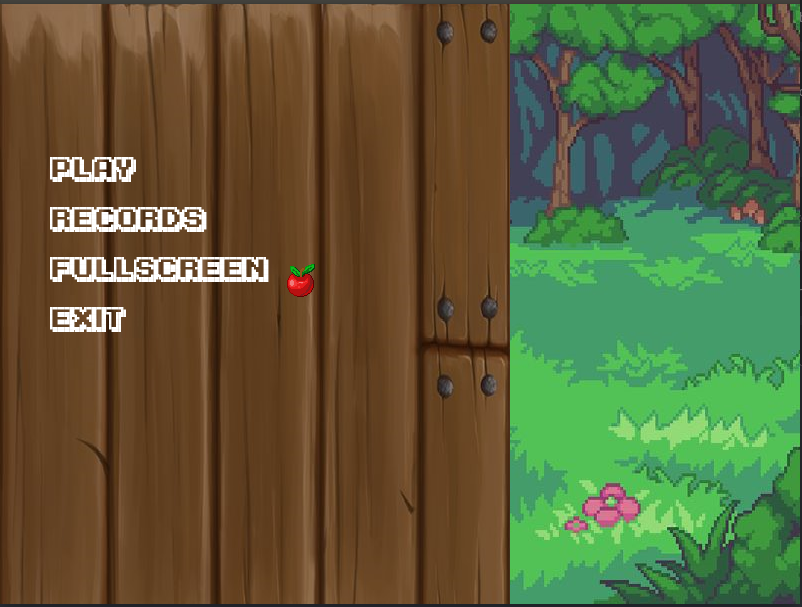
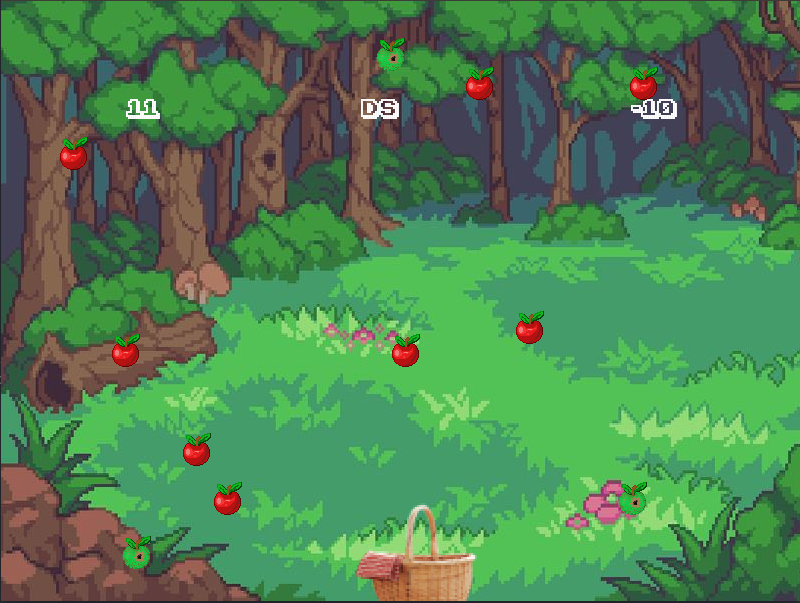

# I Wanna Be the Boshy Kids Version
Yolo-coded game with Component object model.
Actually this project is based on  <a href="https://github.com/alohaeee/FishingForFishies">this game</a> 
## Gameplay
Small and quite simple arcade. The main point of game is to catch apples as much as possible.
## Control
Here is player control help-note
```
A,D - to move basket;
```
## Footage
- Menu


- Game play


## Third-party libraries
* <a href="https://www.libsdl.org/download-2.0.php">SDL2</a>
* <a href="https://www.libsdl.org/projects/SDL_image">SDL2 image</a>
* <a href="https://www.libsdl.org/projects/SDL_ttf/">SDL2 ttf</a>
* <a href="https://www.libsdl.org/projects/SDL_mixer/">SDL2 mixer</a>
## Assets 
